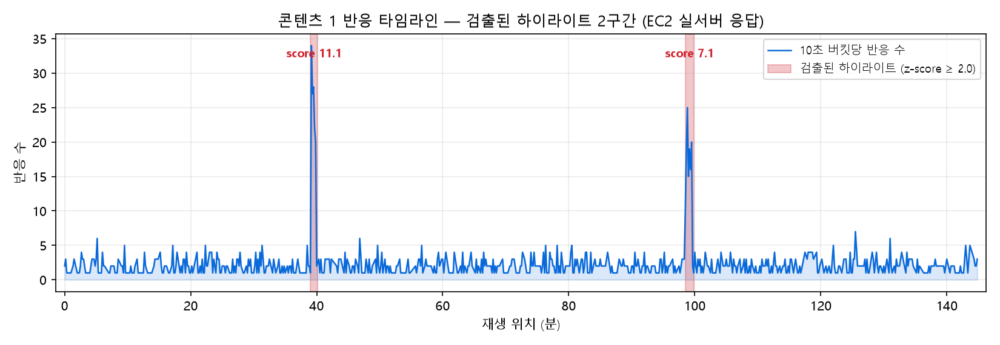
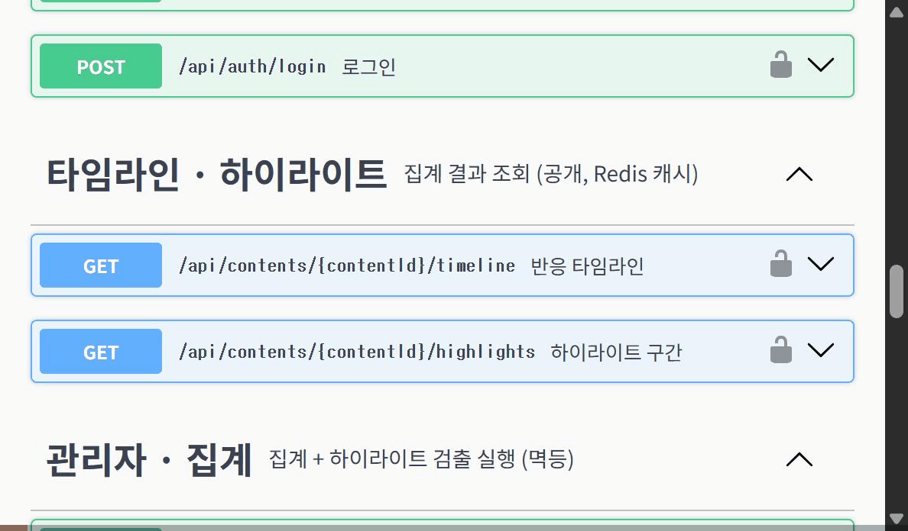
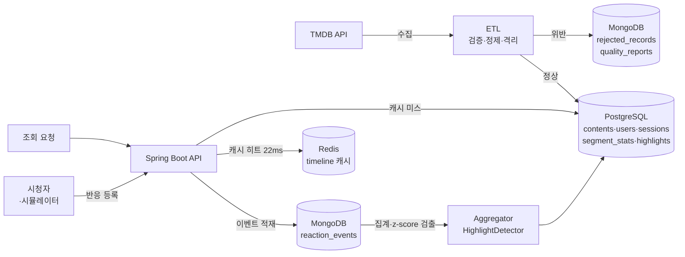
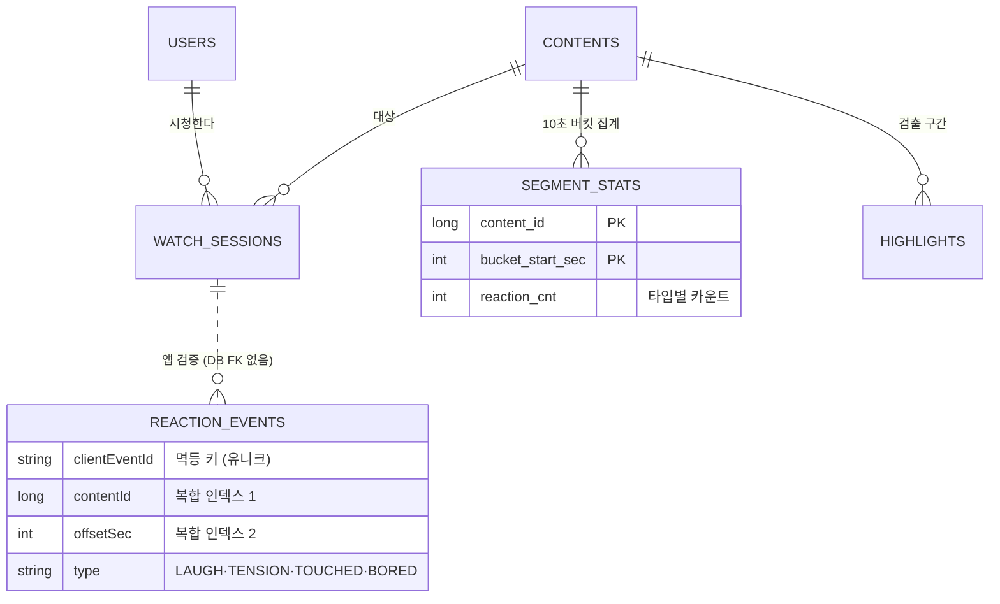

# SceneLog — 콘텐츠 반응 분석 백엔드

시청자가 영상을 보며 느낀 반응(웃음·긴장·감동·지루함)을 몇 초 지점에서 눌렀는지 모아,
그 데이터에서 **"사람들이 가장 강하게 반응한 구간"을 통계적으로 찾아내는** 백엔드 서비스입니다.

찾아낸 구간은 예고편이나 홍보 클립에 쓸 장면을 고르는 근거가 될 수 있고,
반대로 반응이 텅 빈 구간은 시청자가 이탈하기 쉬운 지점을 알려줍니다.

영화 메타데이터는 TMDB에서 자동으로 수집하며, 수집 과정에서 값이 빠졌거나 잘못된
데이터를 걸러내고 그 결과를 기록으로 남깁니다. 공개 정보만 참고한 개인 학습 프로젝트입니다.



*위 그래프가 이 서비스의 결과물입니다 — 반응이 몰린 두 구간(빨간 영역)을 통계가 자동으로 찾아냈습니다.
배포 중인 서버의 API 응답으로 그렸습니다.*

---

## 🌐 데모 (EC2, 서울 리전 — 가동 중)

| | URL |
|---|---|
| **Swagger (API 문서·실행)** | http://13.124.60.61:8080/swagger-ui/index.html |
| 헬스체크 | http://13.124.60.61:8080/actuator/health |
| 타임라인 (공개 API) | http://13.124.60.61:8080/api/contents/1/timeline |
| 하이라이트 (공개 API) | http://13.124.60.61:8080/api/contents/1/highlights |

**데모 계정** (Swagger 우상단 Authorize에 로그인 응답의 accessToken 입력):

```
email:    tester@scenelog.dev
password: password123!   (ROLE_ADMIN — ETL·시뮬레이터·집계 실행 가능)
```

**5분 시연 순서** (Swagger에서):
`POST /api/auth/login` → Authorize → `POST /api/admin/simulate?contentId=2` →
`POST /api/admin/contents/2/aggregate` → `GET /api/contents/2/timeline` · `/highlights`

배포된 서버가 실데이터로 응답하는 모습 (타임라인 → 하이라이트 검출 결과):



---

## 정량 성과 (전부 실측)

| # | 성과 | 근거 |
|---|---|---|
| 1 | 반응 이벤트 **120만 건** 규모에서 (contentId, offsetSec) 복합 인덱스로 조회 스캔량 **1,205,642건 → 239건(1/5,044)**, 집계 API p95 **9,280ms → 2,367ms** | [로그 6호](docs/troubleshooting/2026-08-01-mongo-collscan-index.md) |
| 2 | TMDB 200건 수집 중 정합성 위반 **4건 자동 검출·격리**(미개봉작·runtime=0), 동일 배치 재실행 시 중복 0건(**멱등**) | [dev-log day2](docs/dev-log.md) |
| 3 | 각본에 심은 정답 피크 **2/2 검출**(10초 버킷 해상도 내 일치) + Redis 캐시로 타임라인 p50 **516ms → 22.4ms(~23배)** | [로그 5호](docs/troubleshooting/2026-08-01-redis-cache-record-serialization.md) |

> **정직한 기록**: 성능 측정용 100만 건은 별도 프로파일의 벌크 적재기로 넣었습니다(API 검증 5종 우회).
> API 검증은 시연 모드와 단위 테스트 34개로 별도 검증했습니다. 반응 데이터는 정답을 심은
> 시뮬레이터가 생성한 합성 데이터입니다 — 검출 정확도를 채점하기 위한 의도된 설계입니다.

---

## 아키텍처



**배포**: EC2 t3.micro(RAM 1GB) 한 대에 docker compose로 4컨테이너(app·PostgreSQL·MongoDB·Redis).
인프라(보안그룹·EC2·Elastic IP)는 [Terraform](infra/main.tf)으로 코드화 — 앱 포트(8080)만 공개,
DB 포트는 미개방. 메모리는 컨테이너별 상한 + swap 2GB로 관리해 전 과정 OOM 0회
([로그 7호](docs/troubleshooting/2026-08-01-ec2-deploy-oom-prevention.md)).

### 데이터 모델 (요약 ERD)



원본 이벤트(fact)는 MongoDB, 집계 결과(mart)는 PostgreSQL — 점선은 **DB가 FK로 보장하지
않는 교차 저장소 참조**로, 저장 시점 애플리케이션 검증 + 고아 검출로 지킵니다 (아래 '판단' 참고).

---

## 기술적 판단과 근거

**왜 DB를 두 개(+캐시) 쓰나** — 원본 반응 이벤트는 유형이 늘어나도 스키마 부담이 없어야 해서
MongoDB, 집계 결과·회원·세션은 관계와 트랜잭션이 필요해서 PostgreSQL. 대가는 참조 정합성을
DB가 보장해 주지 않는다는 것 — 저장 시점 애플리케이션 검증으로 메웠고, 실시간 차단이 아닌
사후 검출이라는 한계를 인지하고 있습니다.

**왜 Kafka·Airflow를 안 쓰나** — 지금 규모에서 필요한 처리량이 아니고, 인프라가 늘면 비용과
운영 부담이 함께 늡니다. Spring Scheduling으로 충분하다고 판단했고, "유입이 지속적으로 초당
수백 건을 넘으면 큐 도입"이라는 전환 기준을 남깁니다.

**왜 집계를 전량 재계산으로 하나** — 증분 방식은 워터마크 관리와 재실행 시 이중 계산 위험이
있어, 멱등성을 증명하기 쉬운 전량 재계산(delete+insert 한 트랜잭션)을 택했습니다. 인덱스
실측에서 이 방식의 비용도 확인했습니다 — 콘텐츠당 이벤트가 수십만 건을 넘으면 증분 전환이
필요합니다.

**왜 하이라이트 검출이 통계인가** — 이동평균 + z-score(임계 2.0) + 연속 구간 병합. "AI"라고
부르지 않습니다. 검출 방법은 `method` 컬럼(ZSCORE_V1)으로 버저닝해, 더 나은 방법(V2)이 나와도
결과를 나란히 저장해 비교할 수 있는 구조입니다.

---

## 한계와 다음 단계 (정직하게)

- **반응 데이터가 합성** — 실사용자가 없으므로 시뮬레이터가 생성. 정답을 심어 검출을 채점하는
  용도로는 유효하지만, 실제 사용자 행동 분포와는 다릅니다.
- **집계가 전량 재계산** — 콘텐츠당 이벤트 수십만 건 이상에서는 증분 집계로 전환 필요.
- **스키마 관리가 ddl-auto** — 운영이라면 Flyway 등 마이그레이션 도구가 맞습니다.
- **HTTPS·도메인 없음** — `http://IP:8080`으로 배포 요건을 충족하는 의도적 선택. 운영 전환 시
  도메인 + 인증서 + 리버스 프록시가 첫 과제입니다.
- **Mongo 장애 시 30초 무응답** — serverSelectionTimeout 기본값. 빠른 실패가 필요하면 조정
  ([로그 6호](docs/troubleshooting/2026-08-01-mongo-collscan-index.md)의 장애 주입 실험).

**계획 대비 회고**: 원래 분석 서버(FastAPI)를 따로 두려 했지만, 배포까지 8일 안에 둘 다는
무리라고 판단해 분석을 메인 서버 안으로 합쳤습니다. 범위를 줄인 대신 측정과 문서화에 시간을
썼고, 그 결과가 위의 숫자들입니다.

---

## 기술 스택

Spring Boot 4.1.0 (Java 17) · PostgreSQL 16 · MongoDB 7 · Redis 7 ·
Docker Compose · Terraform · GitHub — 전 구성 [docker-compose.yml](docker-compose.yml) · [infra/main.tf](infra/main.tf)

## 로컬 실행

```bash
# 1. DB만 (앱은 IDE/gradlew) — 로컬 개발
docker compose up -d && ./gradlew bootRun

# 2. 전체 (배포와 동일 구성)
docker compose --profile app up -d --build
```

`.env` 파일 필요: `TMDB_API_KEY`, `JWT_SECRET` (+ `POSTGRES_*` 선택). 커밋되지 않습니다.

## 문서

- [개발 일지](docs/dev-log.md) — 일자별 결과·판단 · [단계별 계획](docs/plans/README.md)
- [트러블슈팅 로그 7건](docs/troubleshooting/) — 이슈·원인·대응
- [학습 가이드 6부작](docs/) — JWT · ETL · 반응수집 · 집계검출캐시 · 시드인덱스 · 배포 (각 md+html)

---

*이 프로젝트는 TMDB API를 사용하지만 TMDB의 보증이나 인증을 받지 않았습니다.
This product uses the TMDB API but is not endorsed or certified by TMDB.
공개 정보만 참고한 개인 학습 프로젝트입니다.*
