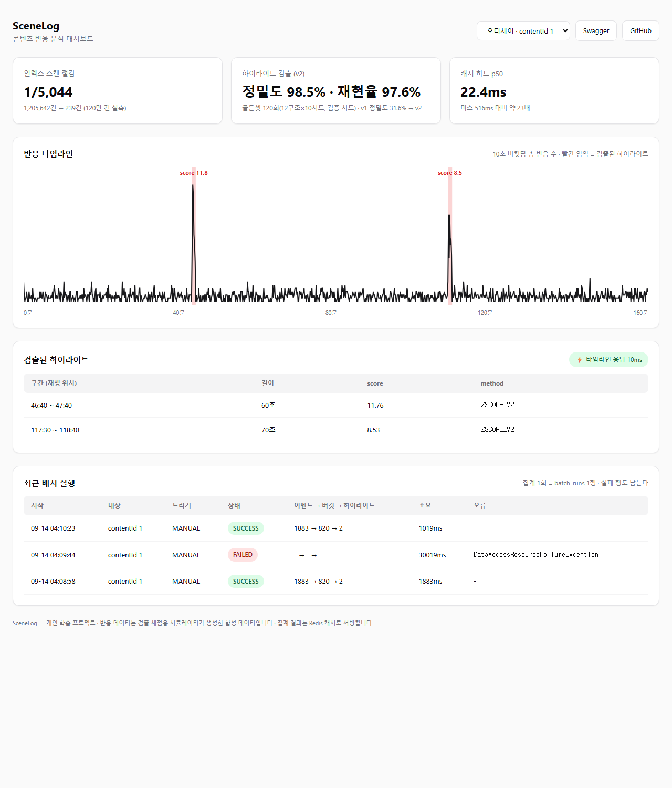
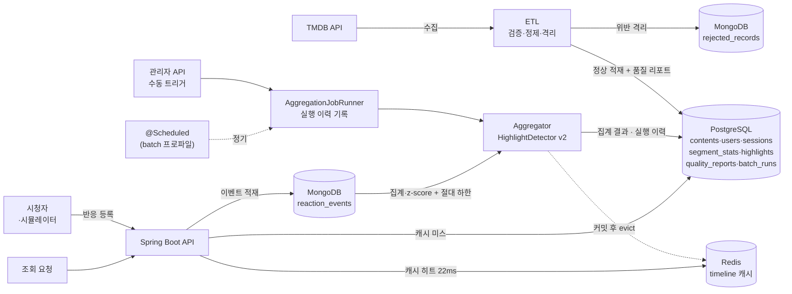
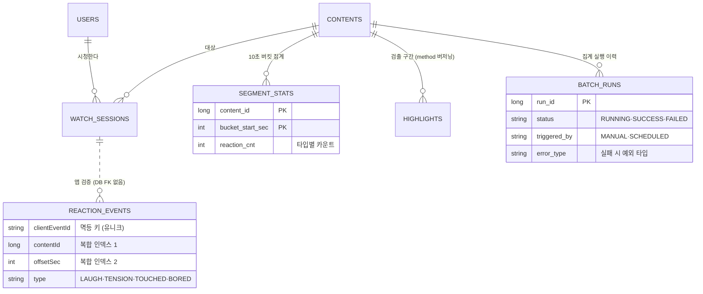

# SceneLog — 콘텐츠 반응 분석 백엔드

> **서류 기준 커밋**: 태그 [`submission-2026-09`](https://github.com/aucu2005/scenelog/releases/tag/submission-2026-09) (2026-09-14).
> 이후 커밋이 늘어도 지원 서류가 가리키는 코드는 이 태그입니다.

시청자가 영상을 보며 느낀 반응(웃음·긴장·감동·지루함)을 몇 초 지점에서 눌렀는지 모아,
그 데이터에서 **"사람들이 가장 강하게 반응한 구간"을 통계적으로 찾아내는** 백엔드 서비스입니다.

찾아낸 구간은 예고편이나 홍보 클립에 쓸 장면을 고르는 근거가 될 수 있고, 반응이 적은 구간도
함께 드러납니다(이탈과의 관계는 재생·중단 이벤트를 추가 수집한 뒤 검증할 다음 단계입니다).

영화 메타데이터는 TMDB에서 자동으로 수집하며, 수집 과정에서 값이 빠졌거나 잘못된
데이터를 걸러내고 그 결과를 기록으로 남깁니다. 공개 정보만 참고한 개인 학습 프로젝트입니다.


*위 그래프가 이 서비스의 결과물입니다 — 반응이 몰린 두 구간(빨간 영역)을 통계가 자동으로 찾아냈습니다.
2026-08-02 배포 서버(EC2)의 API 응답으로 그렸습니다.*

---

## 실행해 보기 (로컬, 약 10분)

**준비물**: Docker Desktop, JDK 17, [TMDB API 키](https://www.themoviedb.org/settings/api)(무료).

```bash
# 1. 시크릿 (커밋되지 않습니다)
cat > .env <<'EOF'
TMDB_API_KEY=발급받은_키
JWT_SECRET=32바이트_이상_임의_문자열
EOF

# 2. 전체 기동 — 배포와 같은 구성 (app·PostgreSQL·MongoDB·Redis)
docker compose --profile app up -d --build
#    개발용: DB 3개만 띄우고 앱은 IDE/gradlew로 → docker compose up -d && ./gradlew bootRun
```

| | URL |
|---|---|
| **★ 대시보드** | http://localhost:8080/ — 타임라인 차트·검출 구간·캐시 응답속도·최근 배치 실행 |
| **Swagger (API 문서·실행)** | http://localhost:8080/swagger-ui/index.html |
| 헬스체크 | http://localhost:8080/actuator/health |
| 타임라인 · 하이라이트 (공개 API) | http://localhost:8080/api/contents/1/timeline · `/highlights` |
| 배치 실행 이력 (공개 API) | http://localhost:8080/api/batch-runs |

**데이터 만들기 (Swagger에서, 순서대로)**

1. `POST /api/auth/signup` — email·password·**nickname**(필수)
2. 관리자 승격 — 가입은 항상 `ROLE_USER`라 관리자 API는 DB에서 직접 올립니다:
   ```bash
   docker exec scenelog-postgres psql -U scenelog -d scenelog -c "update users set role='ROLE_ADMIN' where email='가입한_이메일'"
   ```
3. `POST /api/auth/login` → 응답의 `accessToken`을 우상단 **Authorize**에 입력
4. `POST /api/admin/etl/run?pages=1` — TMDB에서 20편 수집·검증·적재 (품질 리포트가 응답)
5. `POST /api/admin/simulate?contentId=1` — 각본(정답 피크 포함)대로 반응 이벤트 생성
6. `POST /api/admin/contents/1/aggregate` — 10초 버킷 집계 + 하이라이트 검출 (실행 1회가 `batch_runs`에 남음)
7. `GET /api/contents/1/timeline` · `/highlights` → 대시보드 새로고침

선택: 120만 건 성능 재현은 `./gradlew bootRun --args='--spring.profiles.active=seed'`(콘텐츠 2~51에 벌크 적재),
정기 집계는 `--spring.profiles.active=batch`(아래 '운영' 참고).



*로컬 `docker compose`로 띄운 대시보드(2026-09-14). 아래 '최근 배치 실행' 카드에 MongoDB를 일부러 중단해
만든 FAILED 행과 재기동 후 SUCCESS 행이 함께 보입니다.*

**배포 이력**: 2026-08-01~09 AWS EC2 t3.micro(서울)에 [Terraform](infra/main.tf)으로 배포·운영했습니다
(4컨테이너, 전 과정 OOM 0회 — [로그 7호](docs/troubleshooting/2026-08-01-ec2-deploy-oom-prevention.md)).
심사 기간 비용 판단으로 2026-09에 인스턴스를 중지했고, 지금은 위 절차로 로컬에서 같은 구성을 재현합니다.
아래 GIF는 당시 배포 서버에서 캡처한 것입니다.


---

## 정량 성과 (전부 실측)

| # | 성과 | 근거 |
|---|---|---|
| 1 | 반응 이벤트 **120만 건** 규모에서 (contentId, offsetSec) 복합 인덱스로 조회 스캔량 **1,205,642건 → 239건(1/5,044)**, 집계 API p95 **9,280ms → 2,367ms** | [로그 6호](docs/troubleshooting/2026-08-01-mongo-collscan-index.md) |
| 2 | TMDB 200건 수집 중 검증 규칙 위반 **4건 자동 격리**(미개봉작·runtime=0), 동일 배치 재실행 시 중복 0건(**멱등**) | [dev-log day2](docs/dev-log.md) |
| 3 | 하이라이트 검출기 골든셋 **120회 평가**(12구조 × 10시드, 검증 시드 11~20): 정밀도 **31.6% → 98.5%**, 재현율 98.2% → 97.6% (v1 → v2, 절대 하한 도입) + Redis 캐시로 타임라인 p50 **516ms → 22.4ms(~23배)** | [dev-log 8/7·8/9](docs/dev-log.md) · [로그 5호](docs/troubleshooting/2026-08-01-redis-cache-record-serialization.md) |

> **정직한 기록**: 성능 측정용 100만 건은 별도 프로파일의 벌크 적재기로 넣었습니다(API 검증 5종 우회).
> API 검증은 시연 모드와 테스트 **56개**(단위 + 실제 DB를 쓰는 통합, 2026-09-14 `./gradlew test` 전부 통과)로
> 별도 검증했습니다. 반응 데이터는 정답을 심은 시뮬레이터가 생성한 **합성 데이터**입니다 — 검출 정확도를
> 채점하기 위한 의도된 설계이며, 실제 사용자 행동 분포와는 다릅니다.

---

## 아키텍처



**배포 구성**: EC2 t3.micro(RAM 1GB) 한 대에 docker compose로 4컨테이너(app·PostgreSQL·MongoDB·Redis).
인프라(보안그룹·EC2·Elastic IP)는 [Terraform](infra/main.tf)으로 코드화 — 앱 포트(8080)만 공개,
DB 포트는 미개방. 메모리는 컨테이너별 상한 + swap 2GB로 관리해 전 과정 OOM 0회
([로그 7호](docs/troubleshooting/2026-08-01-ec2-deploy-oom-prevention.md)). 로컬 `docker compose`도 같은
상한으로 돌립니다.

### 데이터 모델 (요약 ERD)



원본 이벤트(fact)는 MongoDB, 집계 결과(mart)·품질 리포트·실행 이력은 PostgreSQL — 점선은 **DB가 FK로
보장하지 않는 교차 저장소 참조**로, 저장 시점 애플리케이션 검증 + 고아 검출로 지킵니다 (아래 '판단' 참고).

---

## 운영 — 정기 집계 · 실행 이력 · 모니터링 (2026-09-14 추가)

| 질문 | 답 | 근거 |
|---|---|---|
| 집계는 언제 도나 | 기본 프로파일: 관리자 API 수동 트리거만(데모·RAM 1GB 서버). **`batch` 프로파일: `@Scheduled(fixedDelay)`로 이벤트가 있는 모든 콘텐츠를 정기 재집계** — 이전 실행이 끝난 뒤 대기하므로 겹쳐 돌지 않음 | `analytics/batch/AggregationScheduler` · [dev-log 9/14](docs/dev-log.md) 실행 로그 |
| 배치가 실패하면 어떻게 아나 | 실행 1회 = `batch_runs` 1행(시작·종료·상태·처리 건수·오류 타입). 기록은 집계와 **별도 트랜잭션**(REQUIRES_NEW)이라 집계가 롤백돼도 실패 행이 남음. 대시보드 '최근 배치 실행' 카드 + `GET /api/batch-runs` | 장애 주입: MongoDB 중단 → 30초 후 FAILED(`DataAccessResourceFailureException`) → 재기동 후 SUCCESS ([dev-log 9/14](docs/dev-log.md)) |
| 캐시가 옛 값을 보여 주지는 않나 | 캐시 삭제를 **DB 커밋 이후**에 실행하도록 고정(`transactionAware`). 커밋 전 삭제로 옛 집계가 재적재되던 창을 없앰 | `CacheEvictAfterCommitTest` 3건 — 커밋 전 잔존 · 커밋 후 삭제 · 롤백 시 미삭제 |
| 서버 상태는 | Spring Actuator `health`·`info`·`metrics` 노출, compose 헬스체크가 `/actuator/health` 사용 | `application.yml` · `docker-compose.yml` |

```bash
# 정기 집계 로컬 실행 (20초 간격 예시 — 기본값은 10분)
./gradlew bootRun --args='--spring.profiles.active=batch --scenelog.batch.aggregate.fixed-delay=PT20S'
```

하지 않은 것도 적습니다 — 다중 인스턴스 동시 실행 방지(ShedLock 등)는 **미적용**(단일 인스턴스 전제),
커밋 직전에 시작한 조회가 삭제 뒤 옛 값을 캐시에 쓰는 경쟁은 **남아 있음**(TTL 10분이 안전망).

---

## 기술적 판단과 근거

**왜 DB를 두 개(+캐시) 쓰나** — 원본 반응 이벤트는 유형이 늘어나도 스키마 부담이 없어야 해서
MongoDB, 집계 결과·회원·세션·품질 리포트·실행 이력은 관계와 트랜잭션이 필요해서 PostgreSQL. 대가는
참조 정합성을 DB가 보장해 주지 않는다는 것 — 저장 시점 애플리케이션 검증으로 메웠고, 실시간 차단이 아닌
사후 검출이라는 한계를 인지하고 있습니다.

**왜 Kafka·Airflow를 안 쓰나** — 지금 규모에서 필요한 처리량이 아니고, 인프라가 늘면 비용과
운영 부담이 함께 늡니다. 정기 실행은 `batch` 프로파일의 `@Scheduled`로, 실행 이력은 `batch_runs` 표로
해결했고(위 '운영'), "유입이 지속적으로 초당 수백 건을 넘으면 큐 도입", "인스턴스가 2대 이상이 되면
분산 락"이라는 전환 기준을 남깁니다.

**왜 집계를 전량 재계산으로 하나** — 증분 방식은 워터마크 관리와 재실행 시 이중 계산 위험이
있어, 멱등성을 증명하기 쉬운 전량 재계산(delete+insert 한 트랜잭션)을 택했습니다. 인덱스
실측에서 이 방식의 비용도 확인했습니다 — 콘텐츠당 이벤트가 수십만 건을 넘으면 증분 전환이
필요합니다.

**왜 하이라이트 검출이 통계인가** — 이동평균 + z-score(임계 2.0) + 연속 구간 병합. "AI"라고
부르지 않습니다. 골든셋 120회 평가에서 v1의 정밀도가 31.6%에 그친 원인을 **z-score의 상대성**(피크가
없는 콘텐츠는 σ가 작아 노이즈도 z≥2.0을 넘음)으로 규명하고, v2는 "z≥2.0 **그리고** 평활값 ≥ 평균×2.5"의
2단 판정으로 정밀도 98.5%(재현율 97.6%)를 얻었습니다. 상수 2.5는 **튜닝 시드(1~10)** 스윕으로 고르고
공식 숫자는 **한 번도 안 본 검증 시드(11~20)**로 쟀습니다(자기 채점 방지). 검출 방법은 `method`
컬럼(ZSCORE_V1 → ZSCORE_V2)으로 버저닝해 V1 결과를 지우지 않고 나란히 비교할 수 있습니다.

**왜 캐시 삭제를 커밋 뒤로 미루나** — `@Transactional`과 `@CacheEvict`가 한 메서드에 있으면 어느 쪽이
먼저 끝나는지는 AOP 프록시 순서에 달려 있어 문서화된 보장이 아닙니다. 실측에서 삭제는 트랜잭션과 무관하게
즉시 나갔고, 그 사이 조회가 옛 집계를 캐시에 다시 넣을 수 있었습니다. 삭제를 커밋 이후로 고정하고 그
순서를 테스트로 잠갔습니다.

---

## 한계와 다음 단계 (정직하게)

- **반응 데이터가 합성** — 실사용자가 없으므로 시뮬레이터가 생성. 정답을 심어 검출을 채점하는
  용도로는 유효하지만, 실제 사용자 행동 분포와는 다릅니다.
- **검출기의 남은 약점** — 강한 피크와 약한 피크가 섞인 콘텐츠(구조 8)에서 약한 피크 4개를 놓칩니다.
  강한 피크가 σ를 부풀려 생기는 문제라 절대 하한으로는 못 고치며, median/MAD 기반이 다음 후보입니다.
- **데모 서버 중지** — 심사 기간 비용 판단(2026-09). 위 로컬 절차로 10분 안에 같은 구성이 재현됩니다.
- **정기 배치는 단일 인스턴스 전제** — 분산 락 미적용. 인스턴스가 늘면 ShedLock 등이 먼저입니다.
- **캐시 경쟁 창** — 커밋 직전 시작한 조회가 삭제 뒤 옛 값을 쓸 수 있음. TTL 10분 안전망, 필요 시 지연 이중 삭제.
- **집계가 전량 재계산** — 콘텐츠당 이벤트 수십만 건 이상에서는 증분 집계로 전환 필요.
- **스키마 관리가 ddl-auto** — 운영이라면 Flyway 등 마이그레이션 도구가 맞습니다.
- **HTTPS·도메인 없음** — `http://IP:8080`으로 배포 요건을 충족하는 의도적 선택. 운영 전환 시
  도메인 + 인증서 + 리버스 프록시가 첫 과제입니다.
- **Mongo 장애 시 30초 무응답** — serverSelectionTimeout 기본값. 장애 주입에서도 실패 판정까지 30초가
  걸렸습니다([dev-log 9/14](docs/dev-log.md)). 빠른 실패가 필요하면 조정
  ([로그 6호](docs/troubleshooting/2026-08-01-mongo-collscan-index.md)의 장애 주입 실험).

**계획 대비 회고**: 원래 분석 서버(FastAPI)를 따로 두려 했지만, 배포까지 8일 안에 둘 다는
무리라고 판단해 분석을 메인 서버 안으로 합쳤습니다. 범위를 줄인 대신 측정과 문서화에 시간을
썼고, 그 결과가 위의 숫자들입니다.

---

## 기술 스택

Spring Boot 4.1.0 (Java 17) · PostgreSQL 16 · MongoDB 7 · Redis 7 ·
Docker Compose · Terraform · GitHub — 전 구성 [docker-compose.yml](docker-compose.yml) · [infra/main.tf](infra/main.tf)

## 문서

- [개발 일지](docs/dev-log.md) — 일자별 결과·판단 · [단계별 계획](docs/plans/README.md)
- [트러블슈팅 로그 8건](docs/troubleshooting/) — 이슈·원인·대응
- [학습 가이드 6부작 + 프로젝트 종합 가이드](docs/) — JWT · ETL · 반응수집 · 집계검출캐시 · 시드인덱스 · 배포 · [종합](docs/프로젝트종합-가이드.md) (각 md+html)
- 설계 스펙·구현 계획 — [골든셋 평가](docs/superpowers/specs/2026-08-07-golden-set-precision-design.md) ·
  [검출기 v2](docs/superpowers/specs/2026-08-07-detector-v2-min-lift-design.md) ·
  [배치 운영 보강](docs/superpowers/specs/2026-09-14-batch-ops-readme-sync-design.md)

---

*이 프로젝트는 TMDB API를 사용하지만 TMDB의 보증이나 인증을 받지 않았습니다.
This product uses the TMDB API but is not endorsed or certified by TMDB.
공개 정보만 참고한 개인 학습 프로젝트입니다.*
